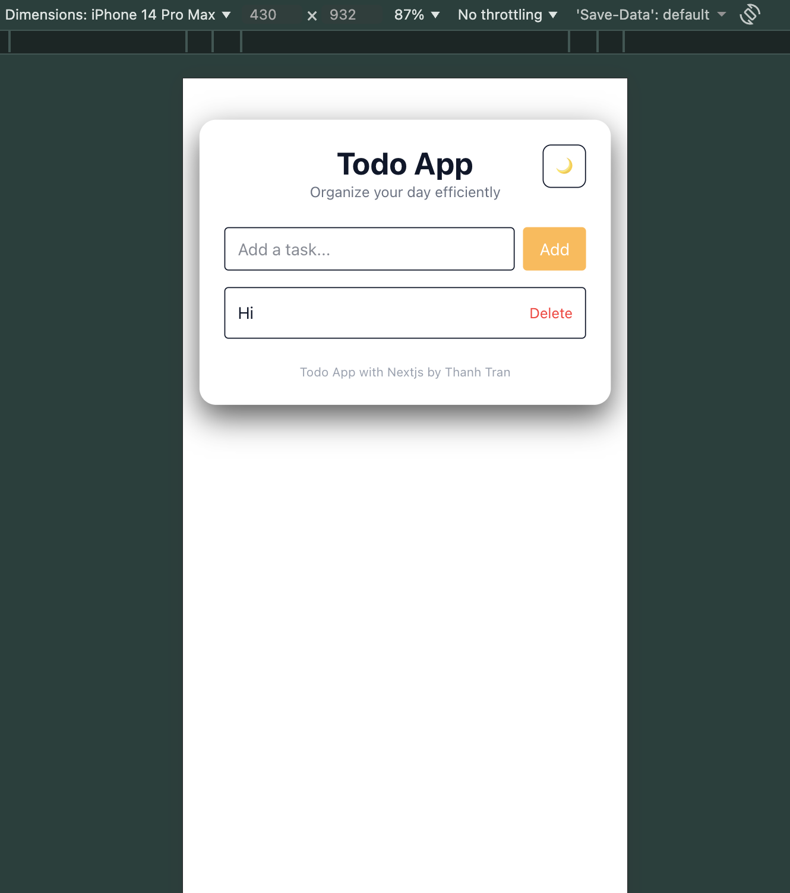
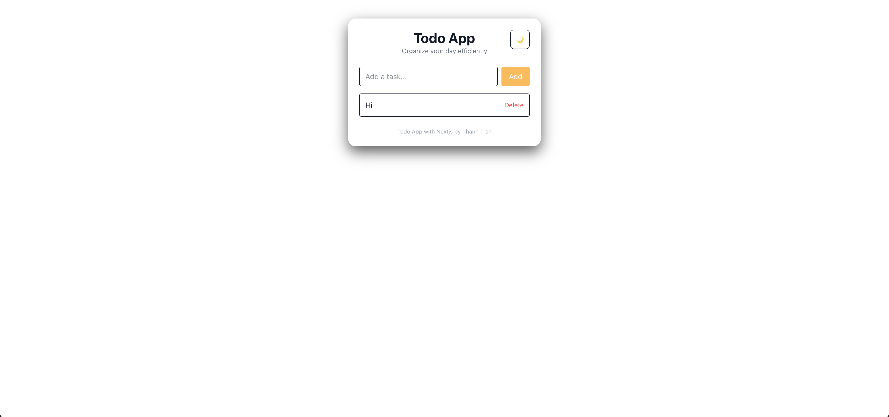

# Clean Todo App

A minimal, mobile-first Todo app built with Next.js App Router, Zustand and Tailwind CSS.

Live demo: https://react-todo-app-liart-pi.vercel.app/

## Screenshots

| Mobile                        | Desktop                        |
| ----------------------------- | ------------------------------ |
|  |  |

---

## Features

- Add, complete and delete todos
- Persist todos to localStorage
- Mobile-first responsive layout
- Clean component architecture
- Built with Next.js App Router

## Tech Stack

- Next.js App Router
- TypeScript
- Tailwind CSS

## Folder Structure
```
app/
components/
hooks/
lib/
types/
```

## Run locally

```bash
npm install
npm run dev
```
